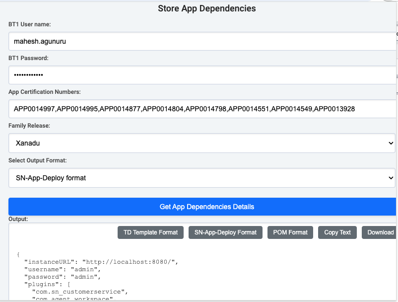

# AppDependencyExtension

Current Manual Process:

- After every release, we manually check each app record in BT1 to:
    - Find the latest release version for each app.
    - Identify any new transitive dependencies added or removed from our direct dependencies.
- Once we have this data, we:
    - Update TD templates.
    - Modify the Test Project POMs with latest versions.
    - Update sn-app-deploy plans.
- for teams like SOM, where we have around 20-25 dependencies it takes significant amount of time for this manual process.

This extension helps us to

- Quickly gathers transitive dependency versions for all direct dependencies from BT1 using table API.
- Converts retrieved information into TD template format.
- Helps creating TD templates with specific release versions, particularly helpful when PMs request these templates for TD with particular versions.
- Expedites the setup of sn-app-deploy plans, useful for debugging issues in previous versions.
- Minimizes the risk of manual errors in fetching transitive dependencies from BT1.

